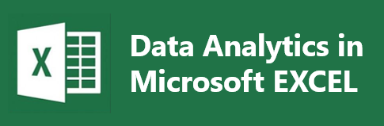

# Project: AD Analytics using Excel Only

## Introduction
Excel is one of the most popular tools, and since we will be working with many stakeholders who may not know programming languages, it is necessary to create Excel-based exploration features. Data analysis is the beautiful art of thoroughly analyzing data to gain insights for business applications. In this project, we will analyze the impact of advertisements on businesses like YouTube and Google, using a dataset with 16,834 rows of data.

## Project Topic: AD Analytics using Excel Only

### Workflow Processes

1. **Identifying Questions**
2. **Collecting & Storing Data**
3. **Cleaning Data and Preparation**
4. **Analyzing Data**
5. **Visualizing Data**
6. **Interpretation**

#### Identifying Questions

1. Who should our target be?
2. What is the highest click rate and what is the rate?
3. Which platform has the highest click per ad?

#### Collecting & Storing Data

The data source for this project is [Kaggle](https://www.kaggle.com/datasets/avinashlalith/merkle-sokrati-advertising-campaign/data). Feel free to fork this repo.

#### Cleaning Data and Preparation

We check for cells that won't contribute to our analysis and delete the Product column because it doesn't have any values.

#### Analyzing Data

1. Create a column for CPC (Cost Per Click) since CPC = Spends / Clicks using this formula: `=IFERROR(M3/O3,0)`
2. Create a Pivot Table to:
    - See your entire data in a visual form for quick summary analysis and perform some calculations.
    - Filter rows dynamically.
    - Use for visualization and flexible data grouping.
3. Calculate Click Per Action: `spends / link_click`
4. Format cells into categories like currency and comma-separated values.

#### Visualizing Data

Duplicate the table to separate Google and Facebook for better visuals.
1. Visualize data by device, age, and campaign platform.
2. Use a stacked bar chart to show visualizations.
3. View the Dashboard table for visualization.

## Conclusion

1. The age group with the highest impressions is between 25-34, with over $564,000 in Facebook, and the most CPA (Cost Per Action) platform is Google.
2. Even though the product of Google is more than that of Facebook, Facebook still has good impressions.
3. The clicks and the amount per click determine the money made.

## Contribution

Thanks for going through my project. I hope you found value in it. Please feel free to comment, contribute, and ask any questions. Reach out to me at [arcdaniel20@gmail.com](mailto:arcdaniel20@gmail.com).

### Key Concepts

- **Impression**: When someone views your ad.
- **Click**: When someone actually clicks on your ad.
