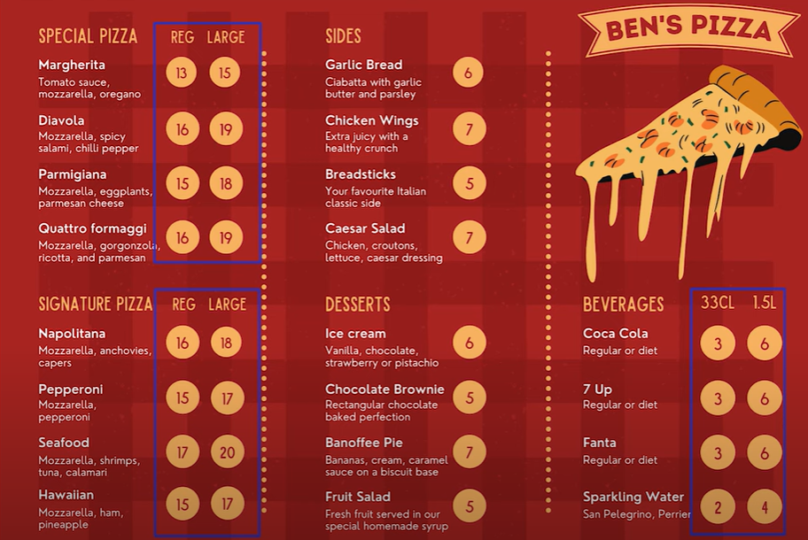

# Project: SQL DATABASE DESIGN and building from scratch

## Introduction
Mr Rob is our client. He just started a pizza shop and was hoping to tocompete with Pizzahut. 
He want Daniel's analytics to design a database that will capture all his information(sales, employee, stock) and and would give him a visual represntation of whats happening in his company aso that he can make good business decisions.

### Tools
    Python
    vscode
    quickdatabase designer https://www.quickdatabasediagrams.com/
## Project Name: ROB-PIZY

1. **Identifying Questions**
2. **Collecting & Storing Data**
3. **Cleaning Data and Preparation**
4. **Analyzing Data**
5. **Visualizing Data**
6. **Interpretation**

#### Identifying Questions

###### Client's Brief
Rob wants us to focus on three areas: use quickdatabase to visualize your build
##### 1. Order
        1. item name
        2. item price
        3. Quantity 
        4. Customer name
        5. Delivery address

               breakdown
            1. row_id pk (prinamry key)
            2. order_id varchar (10)
            3. created_at datetime 
            4. item_name varchar(50)
            5. item_cat varchar(50)
            6. item_size(20)
            7. quantity int
            8. cust_firstname varchar(50)
            9. cust_lastname varchar(50)
            10.delievery boolean
            11. delevery address1 varchar(200)
            12. delevery address2 varchar(200)
            13. delivery_city varchar(50)
            14. delivery_zipcode varchar(50)
             
             due to our customers colum in order table has some redundant rows, we will normalize it by creating a customers table 
             Customers
             cust_id int pk
            1. cust_firstname varchar(50)
            2. cust_lastname varchar(50)

            then specify the relationship between the two tables 
            # do same for delivery addresses
            delevery_address1 varchar(200)
            delevery_address2 varchar(200)
            delivery_city varchar(50)
            delivery_zipcode varchar(50)
            and add the address id to the order table and add NULL to the add_id, this is because the quicj db by default makes it Not Null

            #DO SAME FOR ITEM
            Item
-
            item_id Varchar(10) FK >- Orders.item_id
            item_name varchar(50)
            item_cat varchar(50)
            item_size(20)
            item_price(10,2)
This is what our table looks like 

##### 2. Stock control
###### The stcok control requirements are , Rob will like to know:

        1. Wants to be able to know when its time to order new stock
            To do this we are agoing to need more information about
                1. what ingrdeients to into pizza
                2. their quantity based on size of the pizza
                3. the existing stock level
            #lets assume the lead time for all delivery is the same for all ingredients

            ingredient
                ing_id varchar(10) pk FK >- recipe.ing_id
                ing_name varchar(200)
                ing_weight int
                ing_meas varchar(20)
                ing_price decimal(5,2)

                recipe
                -
                row_id int pk 
                recipe_id varchar(20) FK >- Item.sku
                ing_id varchar(10)
                quantity int

                inventory 
                -
                inv_id int pk FK >- recipe.ing_id
                item_id varchar(10)
                quantity int
This is what our table looks like 

##### 3. Staff. Rob would like to know:
     STAFF DATA REQUIREMENT
        1. Wants to know which staff members are working when 
        2. Based on the staff salary infromation, how much each pizza costs(ningredients+chef+delivery)

                staff
                -
                staff_id varchar(20) pk
                first_name varchar(50)
                last_name varchar(50)
                position varchar(100)
                hourly_rate decimal(5,2)

                shift
                -
                shift_id varchar(20) FK >- rota.shift_id
                day_of_work varchar(10)
                start_time time
                end_time time

                rota
                -
                row_id int pk
                rota_id varchar(20)
                shift_id varchar(20)
                datedatetime FK >- Orders.created_at
                staff_id varchar(20) FK >- staff.staff_id
This is what our table looks like 

#### the full schema :
This is what our table looks like 